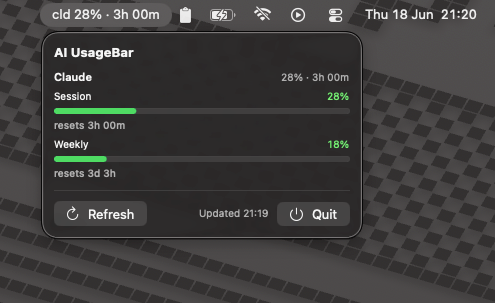

# AI UsageBar

A native macOS **menu bar** app that shows your AI plan usage (Anthropic Claude,
OpenAI Codex, Z.AI, OpenRouter, DeepSeek) right next to the battery icon — no
subscription, no extra account.

It's fully self-contained. All the data collection — reading the OAuth
credentials your `claude` / `codex` CLIs already wrote, the macOS Keychain
fallback, token refresh, the undocumented usage endpoints, caching — runs
natively in-process, with no external process or CLI. The data layer is a Swift
port of [**ai-usagebar**](https://github.com/akitaonrails/ai-usagebar) by
AkitaOnRails (a Rust-based Waybar widget + TUI, itself inspired by
`claudebar`/`codexbar`), which did the original reverse-engineering of the
vendor endpoints and OAuth flows. Full attribution in [Credits](#credits) and
[`THIRD_PARTY.md`](THIRD_PARTY.md).

## Screenshot



```
┌──────────────────────────────────────────────┐
│ AIUsageBar.app (SwiftUI)                     │   MenuBarExtra UI, refresh loop
│        │                                     │
│        ▼  NativeUsageClient (AIUsageBarKit)  │   native, in-process
│        ▼                                     │
│  ~/.claude Keychain · ~/.codex · API keys    │   credentials
│        ▼  URLSession                         │
│  Anthropic / OpenAI / Z.AI / OpenRouter / DS │   OAuth refresh, usage endpoints, caching
└──────────────────────────────────────────────┘
```

## Requirements

- macOS 13 Ventura or newer (for `MenuBarExtra`).
- Log in once with the official CLIs so the credentials exist:
  - `claude` (Anthropic) — token auto-refreshes; on macOS it's read from the login Keychain.
  - `codex login` (OpenAI).
  - Z.AI / OpenRouter / DeepSeek use API keys via env vars or a `config.toml`
    (see [Configuration](#configuration)).

No Rust toolchain, no CLI install — nothing beyond Swift to build and run.

## Run it (dev)

```bash
swift run          # launch the app (shows a Dock icon in a dev build)
swift test         # unit tests for the data layer
```

## Configuration

Optional. Mirrors upstream `ai-usagebar`'s `~/.config/ai-usagebar/config.toml`
(honoring `$XDG_CONFIG_HOME`). Every field has a sensible default, so the file
is only needed to disable a vendor, choose the primary, or inline an API key:

```toml
[ui]
primary = "anthropic"   # which vendor headlines the menu bar title

[anthropic]
enabled = true

[openai]
enabled = true

[zai]
enabled = true
api_key_env = "ZAI_API_KEY"   # env var wins over the inline key below
# api_key = "…"

[openrouter]
enabled = true
api_key_env = "OPENROUTER_API_KEY"

[deepseek]
enabled = false               # disabled by default (no free tier)
api_key_env = "DEEPSEEK_API_KEY"
```

> **Gatekeeper:** unless you sign + notarize with a paid Apple Developer
> account, first launch needs right-click → Open (or
> `xattr -dr com.apple.quarantine AIUsageBar.app`). No signature is required to
> *run* the app — only to skip that one-time prompt.

## How the data flows

1. Every 60s (and on demand) `NativeUsageClient` fetches all enabled vendors
   concurrently, in-process.
2. Per vendor it reads the credentials (Anthropic from `~/.claude/.credentials.json`
   or the login Keychain; OpenAI from `~/.codex/auth.json`; the rest from API
   keys), refreshes the OAuth token if it's near expiry, and `GET`s the usage
   endpoint via `URLSession`. Responses are cached on disk
   (`~/.cache/ai-usagebar/<vendor>/`) with a 60s TTL and reused as a fallback
   when a live fetch fails.
3. Each vendor's response is rendered into a `VendorUsage` (headline + progress
   gauges + a `low`/`mid`/`high`/`critical` severity) and the rows are drawn.
4. The menu bar title tracks the **primary** vendor (`[ui] primary` in
   `config.toml`).

The vendor catalog (names, short codes) lives in
`Sources/AIUsageBarKit/Vendor.swift`; each vendor's fetch + render logic lives
in `Sources/AIUsageBarKit/Native/<Vendor>Provider.swift`.

## Project layout

```
Sources/
  AIUsageBarKit/   pure, testable data layer
    Vendor.swift       vendor catalog (names, short codes)
    Models.swift       Severity / VendorUsage / UsageGauge
    Native/            the in-process data collection (port of ai-usagebar)
      NativeUsageClient.swift   orchestrator: fetch all vendors, pick primary
      AppConfig.swift           config.toml reader + API-key resolution
      DiskCache.swift           per-vendor on-disk payload cache
      Keychain.swift            macOS login-Keychain access (security(1))
      AnthropicCreds.swift      Claude creds + OAuth token refresh
      CodexCreds.swift          Codex auth.json + JWT + OAuth token refresh
      Support.swift             countdown / severity / money / HTTP / JSON
      AnthropicProvider.swift   …and one <Vendor>Provider.swift per vendor
  AIUsageBar/      the SwiftUI app
    AIUsageBarApp.swift   @main MenuBarExtra scene
    UsageStore.swift      ObservableObject + refresh loop
    MenuContentView.swift dropdown UI
Tests/AIUsageBarKitTests/   XCTest for the kit
Resources/Info.plist        bundle plist (LSUIElement)
```

## Credits

This project would not exist without the upstream work it builds on:

- **[ai-usagebar](https://github.com/akitaonrails/ai-usagebar)** by
  [AkitaOnRails](https://github.com/akitaonrails) — the Rust Waybar widget + TUI
  that reverse-engineered all the data collection (credentials, macOS Keychain,
  OAuth refresh, vendor endpoints, caching). AI UsageBar's data layer
  (`Sources/AIUsageBarKit/Native/`) is a Swift port of it. _MIT._
- **[`claudebar`](https://github.com/mryll/claudebar)** and
  **[`codexbar`](https://github.com/mryll/codexbar)** by
  [mryll](https://github.com/mryll) — the original inspiration for ai-usagebar
  (the OAuth endpoint references, tooltip design, and pacing math). _MIT._

This is an independent macOS-native front-end, not affiliated with or endorsed
by the upstream authors. See [`THIRD_PARTY.md`](THIRD_PARTY.md) for details.

## License

MIT — see [`LICENSE`](LICENSE). The upstream projects are MIT-licensed too.
